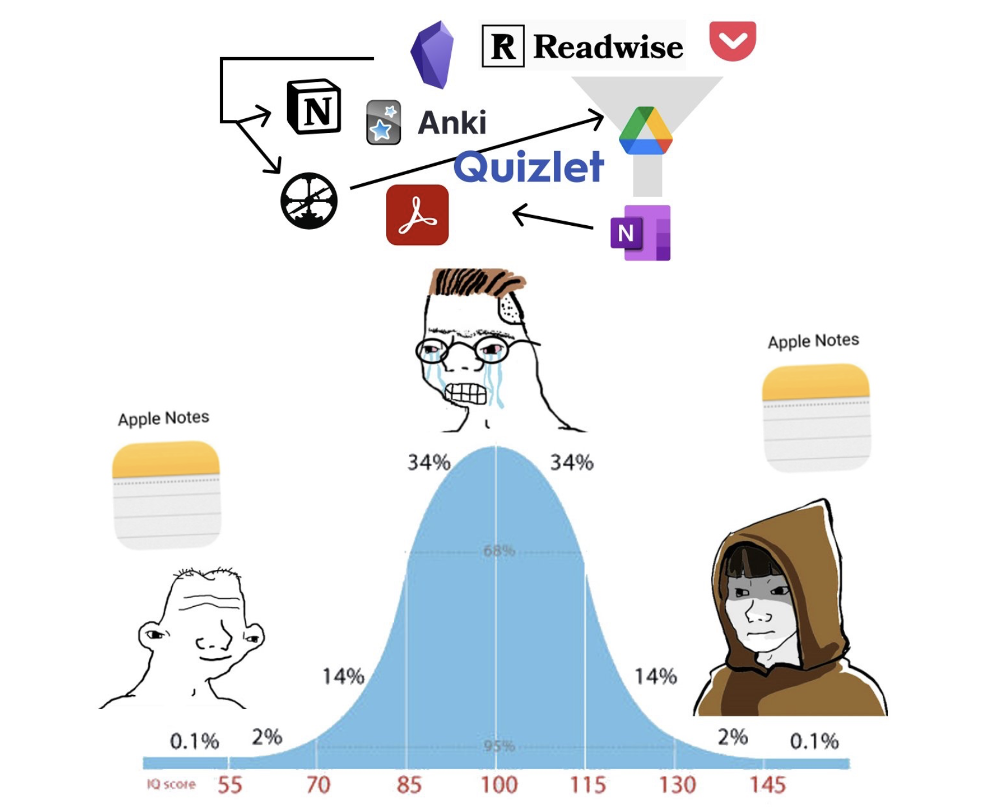

Hace 2,123 días creamos nuestra primera nota en Evernote. El 5 de enero del 2017. Y exactamente hace un año publicamos una lista de nuestros apps favoritos. La lista aún vive, pero con una baja: Evernote.

Y esto a pesar de que el año pasado escribimos:

> Este app es nuestra memoria de largo plazo. Tiene muchos detractores debido a que es un poco antiguo (la versión web fue lanzada el 2008), pesado, y con una interfaz de usuario que podría mejorar. Pero no tiene rivales.

Eso de que no tiene rivales es una pequeña roca. Hay un egg de alternativas. Es sólo que no las habíamos explorado bien.

## por qué estamos separándonos

En la webes y blogosferas hay innumerables artículos que describen incontables razones para dejar de usar Evernote. El precio, la aparente falta de dirección de la compañía, la incapacidad de utilizar markdown, versiones incompatibles (web vs. desktop vs. mobile), etcétera.

Nosotros estamos cortando cables con Evernote por la simple razón de que nos ha fallado en varias ocasiones en los últimos meses. Hemos tenido problemas de sincronización: varios apuntes tomados en el iPhone nunca llegaron a grabarse en el servidor y se perdieron para siempre.

Eso pasó justamente esta semana con una lista de posibles posts para este blog. Así que dijimos hasta aquí nomás. (Y a esto se le suma el hecho de que la interfaz de usuario se ha convertido en un popurrí desordenado de herramientas y funciones).

## qué app escogimos como reemplazo?

No hemos hecho una búsqueda exhaustiva. Revisamos superficialmente apps como Simplenote, Obsidian, Notion, y un par más.

Buscamos lo siguiente:

1. Interface simple, minimalista
2. Capacidad de guardar archivos: fotos, PDFs, etc.

Estas dos guías nos llevaron a escoger Apple Notes. Una aplicación sencilla, sin muchas pretensiones pero que funciona bien.

Ya les contaremos cómo nos va.

## además esto lo dice todo

Este meme estuvo dando vueltas por la web este año haciendo mofa de los gurús de la "productividad".

La gente infra y supradotada usa Apple Notes.

Nosotros usaremos Apple Notes.

Say no more.

