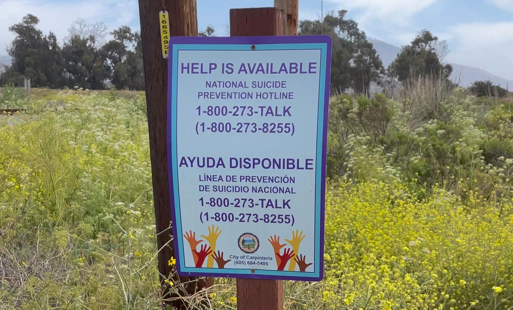

por qué tenía que estar justo ahí ese cartel? por qué!

## reserva natural de Carpinteria Bluffs

Hoy domingo nos despertamos temprano. Como uno ya está casado y tiene familia, ya sabemos que durante los fines de semana no hay dónde esconderse y tener un momento de paz.

Lo primero que hicimos entonces, antes de que nos impongan el itinerario del día, fue abrir Google Maps e inspeccionar la región. Un radio de más o menos 50 kilómetros de la casa.

Encontramos la reserva natural de Carpinteria Bluffs. Habíamos visitado el pueblo de Carpinteria pocas veces, pero nunca la reserva natural. Hay un pequeño sistema de senderos que empiezan al nivel del mar, en una zona muy bonita donde uno puede acampar y entrar a la playa. Los senderos continúan a lo largo del litoral, hacia el sur, y luego se elevan hacia una zona boscosa con eucaliptos, robles, sycamores y, en esta época del año, muchas flores. Este bosque empieza en plena costa, en acantilados que dan al Pacífico y desde los cuales se pueden ver innumerables leones marinos descansando en la arena en playas inaccesibles.

Hay poca gente (porque la mayoría pasa de largo por el freeway sin notar el pequeño pueblo), y dada la situación geográfica, el clima es perfecto: no hace ni mucho frío ni mucho calor. No hay exceso de humedad.

Un lugar precioso y poco conocido.

## (paréntesis)

Todos sufrimos en el trabajo. No somos reconocidos por lo que realmente (creemos que) valemos. Trabajamos horas extra sin que nos paguen. Tenemos que lidiar con burocracia y batallas políticas. El jefe nos asigna proyectos cojudos, los tratamos de reasignar a nuestros subordinados y nos miran con cara de pocos amigos. Nos entregan un mamarracho que tenemos que tratar de arreglar antes de presentarlo al boss… y al final siempre la culpa es nuestra. No importa si ganamos el match 6/2 6/2, nos dicen que debimos haberlo ganado 6/1 6/1.

Obvia y afortunadamente para algunos las cosas no son así todo el tiempo o casi nunca. Pero como bien lo dijimos [aquí](./diversifica), eventual e inevitablemente se sufre. Y quizá se sufre más cuando se está en plena transición de trabajador contento a trabajador descontento.

Bueno pues, en esas estamos y por eso la expedición al medio de la naturaleza en Carpinteria serviría de escape.

## el cartel

Habíamos avanzado un par de kilómetros en el sendero principal en Carpinteria Bluffs. El camino era angosto y flanqueado por flores amarillas. Hablábamos de lo idílico que era el lugar y caminábamos despacio, tratando de absorber el paisaje con la mente en un estado zen de comunión con nuestro único planeta.

Y de pronto, como un homúnculo, como una estatuilla diabólica, como en un cuento de Raymond Carver: el cartel.

Es decir, de un bofetón pisamos tierra, adiós momento zen, good-bye Henry David Thoreau. Oye tú, contempla tu realidad tal cual y decide si marcas el número o te acercas al borde del acantilado que queda aquí nomás a treinta metros y **_te inclinas apenas hacia afuera y te dejas ir, paf se acabó._**

