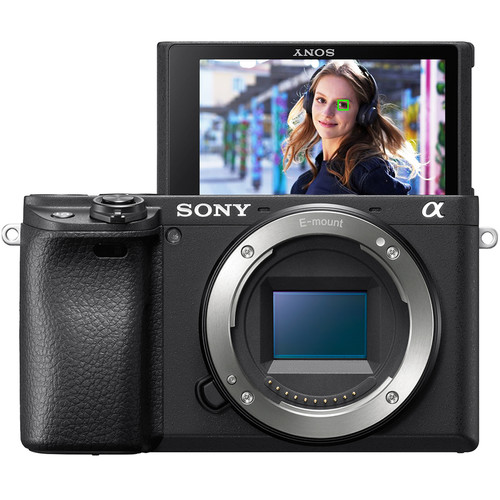
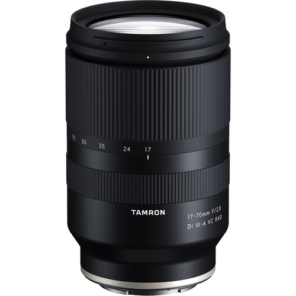
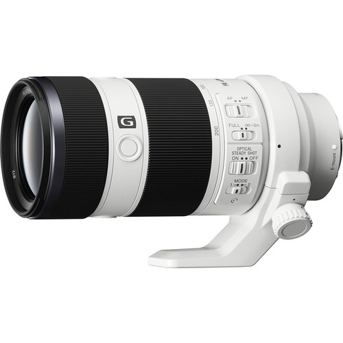
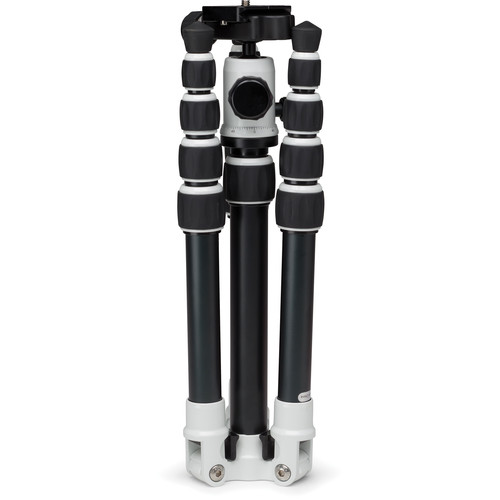

El lado de nerd de cojudeces.com nos impulsa con regularidad a pasar (demasiadas) horas en blogs y sobre todo en Youtube aprendiendo, entre muchas cosas, acerca de los últimos lanzamientos de productos en las categorías de fotografía y video, también husmeamos qué equipos usan nuestros bloggers y creadores favoritos.

La manía con lo de la fotografía comenzó el año 2013 después de un viaje a Alaska. Las fotos que tomó nuestra amiga fotógrafa Claudia eran muy superiores a las fotos que tomamos nosotros... la única explicación era "tiene que ser la cámara" y de inmediato compramos una Nikon DLSR. No se nos ocurrió que Claudia es simplemente mejor fotógrafa.

## uso y postulados básicos

Para nosotros, el uso principal de nuestra cámara es tomar fotos (casi nunca video) durante nuestros viajes y excursiones cercanas y lejanas. Principalmente paisajes naturales y, a menor medida, un poco de **street photography.** Por lo tanto, hemos concluido en los siguientes postulados.

1. \***\*Buen lente + cámara decente > Lente decente + buena cámara\*\***: es preferible invertir más en un buen lente que en una buena cámara (ver abajo nuestra sugerencia de qué lente NO comprar)
2. \***\*Portabilidad\*\***: el equipo tiene que ser ligero y portátil porque si no, al tercer día del viaje uno termina dejando cámara y lentes en el hotel
3. \***\*Disponibilidad de lentes de buena calidad\*\***: tiene que existir como mínimo un buen lente wide y un buen lente zoom
4. \***\*Estabilidad (para video y handheld shots)\*\***: rara vez llevamos un trípode con nosotros (ver punto 2), así que cámaras o lentes con **in body stabilization** son un bonus

## cámara de fotos

Desde mediados del 2019 usamos la Sony A6400. Es mirrorless y crop sensor (factor de recorte de 1.5x). Para nuestro nivel de fotografía y el uso que le damos a nuestra cámara, la A6400 es más que suficiente.

### DSLR vs. Mirrorless

Antes de la Sony, teníamos la Nikon D5300 DSLR. Una buena cámara (de precio razonable) que nos acompañó en viajes por el Sudeste asiático. Cuando llegó el momento de hacer un upgrade, inicialmente consideramos versiones más recientes de la misma cámara o incluso un salto a las Nikon full-frame, pero una lectura rápida de nuestros postulados básicos nos indicó la dirección a tomar:

> La tecnología mirrorless está a la par de la tecnología DSLR y a la vez es más ligera y compacta (postulado 2)

Y no solamente está a la par, sino que creemos que es el inevitable futuro de la fotografía prosumer y profesional.

## full-frame vs. crop sensor

Este es otro punto interesante en la toma de decisiones. Como muchos de ustedes saben, cuanto más se interna uno en el mundo de la fotografía, mayor es la tentación de migrar de crop sensor a full-frame. Uno se auto-convence de que la razón por la cuál mis fotos salen feas y las tuyas salen bien es porque tú tienes una cámara full frame de última generación.

El problema con las full-frame es el \***\*dolor físico\*\*** de tener que llevarlas de un lado a otro (son más pesadas, voluminosas, y los lentes son más grandes y pesados también) y el \***\*dolor económico\*\***.

Nosotros preferimos crop sensor.

Por ejemplo, hacer un upgrade del combo Sony A6400 + Sony E 16-55mm f/2.8 G al equivalente full-frame Sony A7III + Sony FE 24-70mm f/2.8 GM requiere $1,800 adicionales. Los resultados fotográficos son prácticamente iguales.

En este video Mark Denney explica por qué hizo un “downgrade” de full-frame a crop sensor. Vale la pena verlo.

[https://youtu.be/Z6vgwmbWvlg](https://youtu.be/Z6vgwmbWvlg 'haz click para ver el video')

## lentes

Solamente dos lentes, ambos son zoom debido al tema versatilidad. En el pasado hemos experimentado con lentes prime y la cruda realidad es que nos da flojera estar cambiando los lentes todo el tiempo. *Switching costs* elevados.

### Tamron 17-70mm f/2.8

Nuestro lente principal. Lo usamos el 95% del tiempo. Nos da suficiente amplitud para hacer tomas panorámicas y suficiente zoom como para tomar buenos retratos.

Tres elementos adicionales que este [Tamron 17-70mm f/2.8](https://www.bhphotovideo.com/c/product/1609642-REG/tamron_afb070s_700_17_70mm_f_2_8_di_iii_a.html?ref=cojudeces-com.ghost.io) tiene a su favor: 1) cuenta con *in body stabilization*, 2) es capaz de enfocar desde distancias bastante reducidas, algo muy bueno para fotografiar flores o insectos, por ejemplo, y 3) es $600 más barato que su contraparte, el [Sony E 16-55mm f/2.8 G](https://www.bhphotovideo.com/c/product/1502819-REG/sony_e_16_55mm_f_2_8_g.html?ref=cojudeces-com.ghost.io).

### Sony FE 70-200mm f/4 G

El [Sony FE 70-200mm f/4 G](https://www.bhphotovideo.com/c/product/1029862-REG/sony_sel70200g_70_200mm_f_4_5_6_g_lens.html?ref=cojudeces-com.ghost.io) tiene una capacidad extraordinaria de enfoque. Fue nuestro lente favorito en una expedición a Tanzania que hicimos el 2019. Desafortunadamente estos días casi nunca lo llevamos con nosotros porque es pesado y grande y por lo de los switching costs. Altamente recomendable y no creemos que tenga mucho que envidiarle a su hermano mayor, el [Sony FE 70-200mm f/2.8 GM](https://www.bhphotovideo.com/c/product/1222776-REG/sony_sel70200gm_fe_70_200mm_f_2_8_gm.html?ref=cojudeces-com.ghost.io), que *by the way* cuesta $1,100 adicionales.

### extra: qué lente NO comprar

Uno de los peores deals en tema costo-beneficio es el Sony Vario-Tessar T\* E 16-70mm f/4 ZA OSS (tremendo nombre!) que cuesta $798 y es, cómo podríamos describirlo, una kaka? Experimentamos con este lente desde el 2019 al 2021 y NUNCA podíamos enfocar bien.

![[2021-10-sony_sel1670z_16_70mm_f_4_za_lens.jpeg]]

Siempre pensábamos que la culpa era nuestra. “No es posible que un lente de $798 sea una kaka. Esto tiene que ser falla del usuario.” Así pensábamos hasta que vimos este [video](https://youtu.be/WE5I64U-RuQ?ref=cojudeces-com.ghost.io) de Arthur R.

## trípode

Un trípode es definitivamente importante (aunque no imprescindible), a pesar de que esté en conflicto con el postulado 2. Es un accesorio excelente para capturar paisajes al amanecer o atardecer. Y últimamente le encontramos muchísima utilidad para tomar fotos de la familia.

Nosotros usamos el [MeFOTO BackPacker](https://www.bhphotovideo.com/c/product/926387-REG/benro_a0350q0k_0_series_travel_tripod_kit.html?ref=cojudeces-com.ghost.io) desde el 2014 y todo va bien.

## control remoto

Hay mucha gene que recomienda un control remoto y creemos que es una buena idea. Sin embargo, nosotros utilizamos la opción de tomar 5 fotos instantáneas a los 10 segundos de presionar el disparador.

## conclusión

Si quieres mejorar la calidad de tus fotos utilizando mejores equipos (i.e., "graduarte" de la cámara del celular), no hay necesidad de que gastes una gran fortuna, aunque quizá sí una pequeña fortuna. 🙁

Nuestro consejo es comprar una cámara **mirrorless**, **crop sensor**, y seleccionar un **buen lente**.
