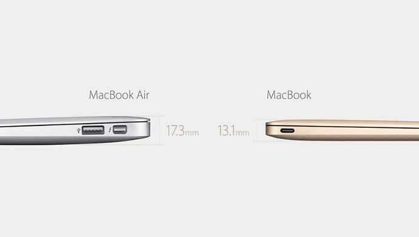
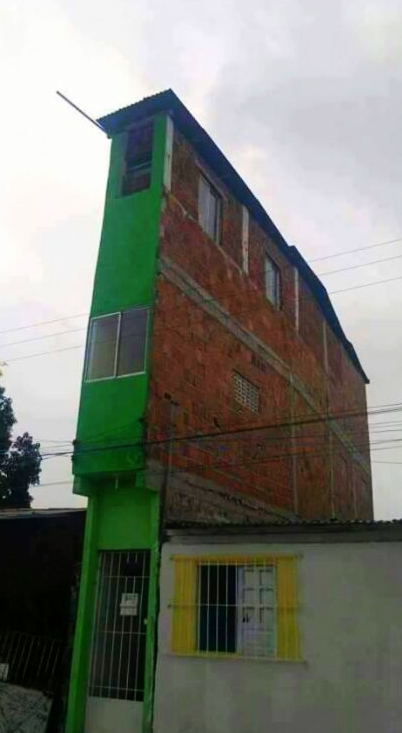

> "La idea fue tomada de la MacBook Air, un producto ligero, estéticamente perfecto y totalmente funcional... ahora con el lanzamiento de la nueva MacBook, como que todo encaja" (Fresa, en marzo del 2015 cuando Apple anunció la MacBook de 13.1mm)

Cuando Fresa y Jano decidieron fundar FJM Constructores allá por el año 2003, el objetivo era ofrecer vivienda vanguardista y asequible a los peruchos que "se consideran iconoclastas del diseño, gustan experimentar altos grados de adrenalina, y no quieren gastar mucho".

Con esa misión lanzaron FJM, tomando como primer paso la contratación del arquitecto de gran trayectoria Markarián (para muestra de sus obras pre-FJM, [click aquí](./lima-peru)). El vigor, esfuerzo y química de los tres socios dio como resultado una decena de edificios de departamentos en el distrito de Surquillo.

"Sin embargo", comenta Fresa, "el mercado de inmuebles en Lima ha llegado al punto de saturación extrema. Casi no hay donde construir y lo que se construye termina sin sabor ni color ni buen gusto."

Hasta que FJM construyó esto.

El diseño se llama Casa Verde.

La inspiración, según Fresa, viene de Steve Jobs y Apple:

> "en algún momento Steve Jobs comentó que uno no debe tratar de proteger sus productos sino más bien seguir creando nuevos productos que compitan con los ya existentes. En otras palabras: canibalizarse. Si uno mismo no se canibaliza, otros lo harán. Nosotros sabemos muy bien que el nuevo diseño *Casa Verde* (ver foto) compite directamente con el diseño *Mamarracho* que hemos venido ofreciendo durante la última década y, sin embargo, ofreceremos ambos productos a pesar de que Mamarracho rinda mejores márgenes. Otro aspecto interesante de Casa Verde es que la idea fue tomada de la MacBook Air, un producto increíblemente ligero, estéticamente perfecto y totalmente funcional. Y bueno, ahora con el lanzamiento de la nueva súper ligera y delgada MacBook de 12 pulgadas, como que Casa Verde tiene la bendición de Apple, y de Steve Jobs, no les parece?"
