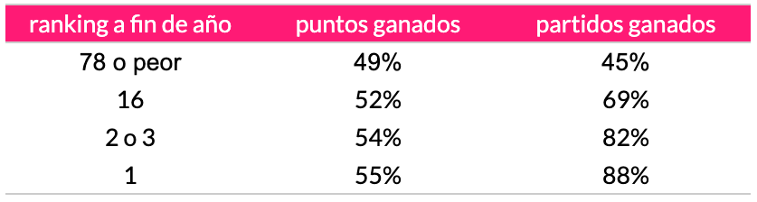

Novak Djokovic ha ganado 20 grand slams y muy probablemente gane varios más en los próximos años. Sus records no llegarán a ser batidos, aunque lo mismo pensamos con los 14 slams de Sampras (año 2012) y los 20 de Federer (año 2018).

Djokovic comenzó su carrera profesional el 2003 y para el año 2007 ya estaba rankeado 3 del mundo. El año 2011 ganó 92% de los partidos que jugó (70 de 76 encuentros) y terminó el año como número 1 del mundo. Desde entonces ha terminado seis temporadas como número 1, y es muy probable que el 2021 sea su séptimo año al tope del ranking de la ATP.

## micro ajustes que amplifican la performance

En los círculos de peak performance, productividad, mejora de hábitos, y desarrollo personal se habla *ad nauseam* de implementar ajustes aquí y allá con el objetivo de mejorar tal o cual cosa o de ser más eficiente y ganar un par de minutos adicionales que a la larga se convierten en días de tiempo extra. Se discuten micro ajustes y más micro ajustes y uno se pregunta si no está siendo víctima nuevamente de charlatanes y engañamuchachos.

## la dieta sin gluten de Novak

Hace años Djokovic mencionó que había dejado de comer gluten. Esa mención coincidió con su ascenso al número 1 del ranking. No tomó mucho tiempo a los gurús de la nutrición y el desarrollo personal atribuir el éxito de Djokovic a la dieta sin gluten.

Nosotros no somos tan cojudos.

También existía la posibilidad de que el ascenso de Novak se haya debido a su talento extremo, a su esfuerzo físico y mental dentro y fuera de la cancha, a su capacidad de entrenar con más intensidad que los demás, también al equipo de profesionales que lo rodea y le da apoyo en temas de táctica, de fitness, de concentración, de administración de su calendario de eventos, de recuperación.

Y, claro, de nutrición también.

Pero es más probable que la combinación y adición de mejoras marginales a lo largo y ancho de todos esos aspectos sean responsables de los resultados en la cancha de tenis.

Lo decimos también porque hemos experimentado con la dieta *gluten free* y seguimos siendo mediocres en todo lo que nos proponemos.

## estadísticas contundentes

Bueno, ya basta de tanto preámbulo.

Lo que queríamos mostrar eran estadísticas avasalladoras de Novak Djokovic. Para esto bajamos data de la página [ultimatetennisstatistics.com](https://ultimatetennisstatistics.com) y completamos un pequeño análisis.

Observen la diferencia marginal en el porcentaje de puntos ganados a lo largo de la trayectoria de Novak. Micro ajustes en puntos ganados y resultados contundentes en partidos ganados y en ranking.

La columna ausente en la tabla es la de dinero. La vida de un tenista rankeado de 78 para abajo es muy diferente a la de un top 20... y la distancia en porcentaje de puntos ganados es tan pequeña.

La vida no es justa. Quizá sí valga la pena esforzarse un poquito más el día de hoy.
