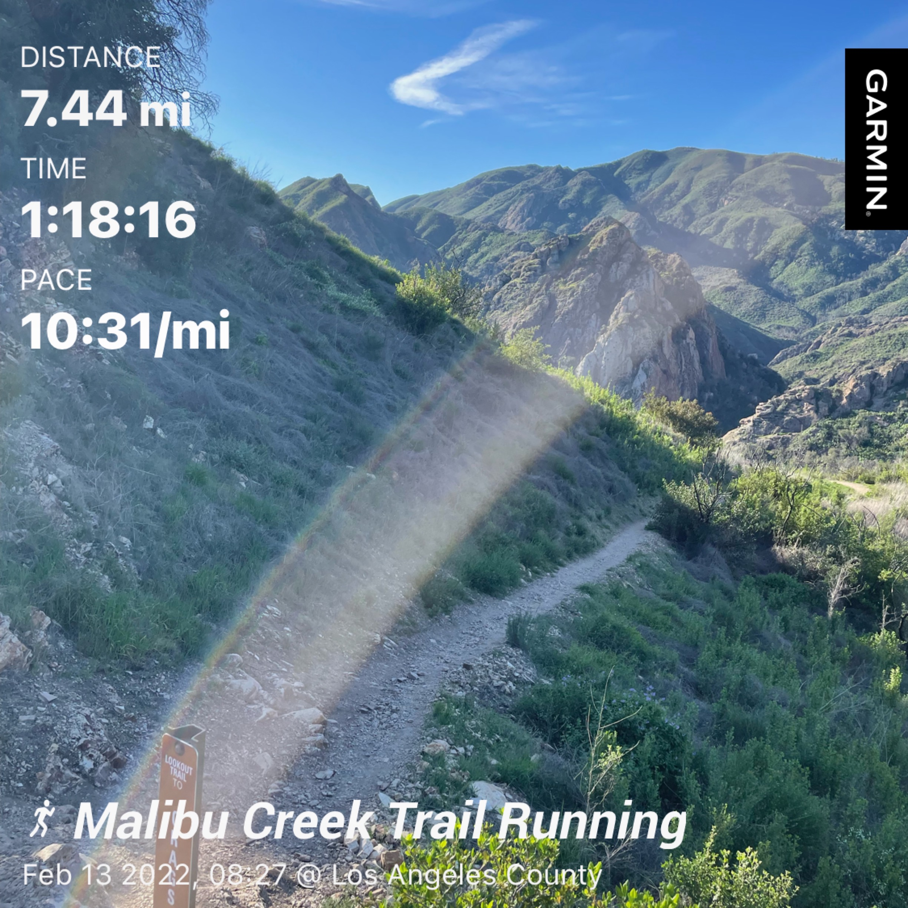
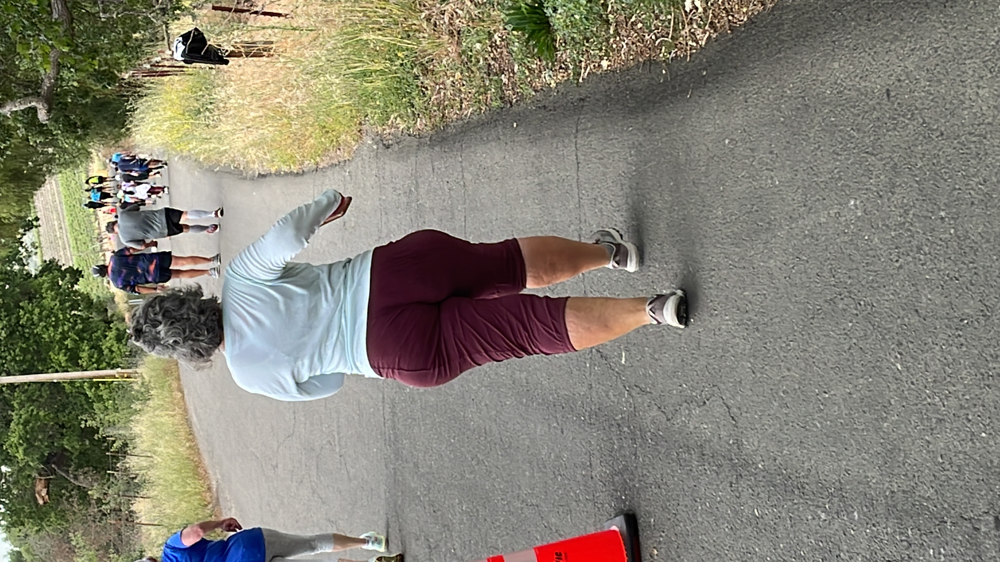
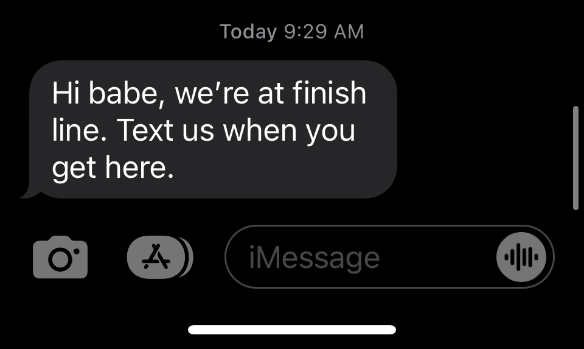
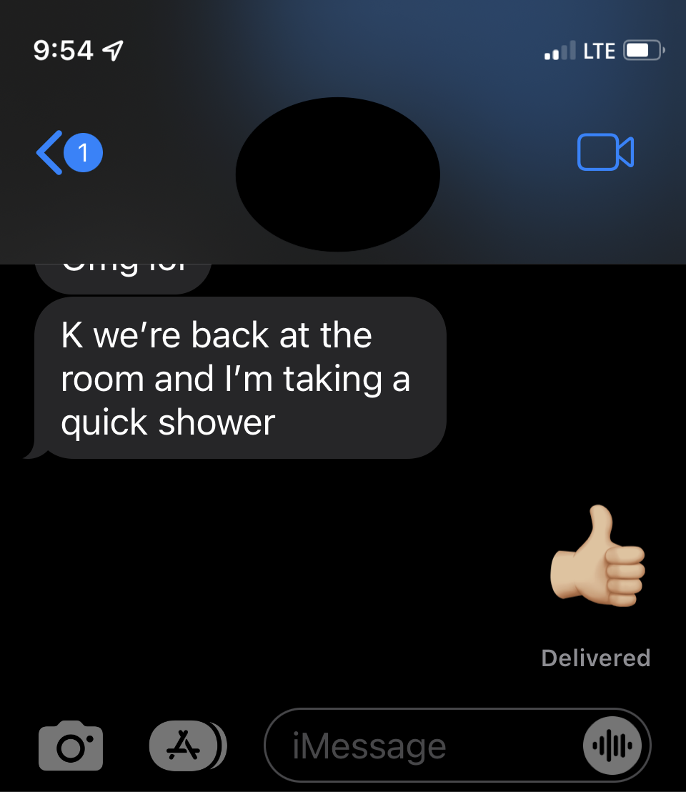

Bueno, aquí estamos. Domingo 8 de mayo. Día de la Madre, cumpleaños de nuestro colaborador Betuco y día siguiente a la infame media maratón. Cuando dije que era la [perfección a la inversa](./regalo-antiperfecto) porque requería sufrir por sufrir, lo hice por chonguear. No imaginé que aquellos comentarios serían los más atinados que he hecho en mucho tiempo. El impulso que me hizo cortar las zapatillas no era un problema psiquiátrico sino instinto de supervivencia... o quizá sea simplemente la patética condición de ser un personaje Dostoyevskiano como [Polzunkov](./un-personaje-de-dostoyevsky):

> En aquella cara se podía contemplar todo: vergüenza e insolente descaro, iracundia, dolor del fracaso, súplica de perdón por el atrevimiento de molestarle a uno, la conciencia del propio valer y, al mismo tiempo, la conciencia plena de la propia insignificancia...

## desentrenamiento

El historial de actividades de Garmin dice que el 13 de febrero fue la última vez que salí a correr. Una pequeña lesión a la pantorrilla nos sentó por dos semanas. En ese ínterin, Fresa también se lesionó y decidió retirarse de la carrera a pesar de que quedaba mucho tiempo para recuperarse y retomar la preparación.

La inercia de la inactividad hizo fácil señalar en mi entorno inmediato cosas que me impedirían entrenar. El trabajo, la falta se sueño, el poco tiempo. Exactamente las mismas cosas que hacía dos semanas no me habían impedido nada y las mismas cosas que nunca impidieron que mi esposa se prepare.

Sabía que participaría en la carrera porque no había escapatoria, sabía que el precio a pagar era la vejación y la ofensa personal, pero aun así (o quizá por eso mismo) dejé de lado toda forma de esfuerzo el 13 de febrero. Dostoyevsky.

## observaciones del día previo a la carrera: gente atlética, no atlética, y nosotros

La sede era el pueblo de Solvang, una pequeña colonia danesa en el medio del Santa Ynez Valley. Solvang nos queda a dos horas en auto y por algún motivo decidimos llegar no una sino dos noches antes de la carrera.

Ese pueblito se recorre a pie en una hora. Y no solo eso, sino que a los 15 o 20 minutos uno ya se ha formado una buena idea de todo: pastelerías, cafés, tiendas de souvenirs, más pastelerías, más cafés en una arquitectura de provincia que también se repite de cuadra en cuadra.

En otras palabras: zzz 😴 zzz

El día previo a la media maratón ya se veía más gente que había llegado para la competencia. Era obvio por los relojes Garmin, las zapatillitas de colores, la ropita con logos de otras carreras.

En algunos casos (la minoría) lo que los delataba no era toda la parafernalia sino la contextura atlética de los competidores. Esta observación reveló un nuevo roche en las pobres vidas de los integrantes del escuadrón:

> hay gente atlética, gente no atlética, y nosotros

La gente atlética tiene la genética para destacar en actividades físicas. El entrenamiento esculpe sus cuerpos y afilan su performance.

La gente no atlética no nació con la disposición para los deportes. Llega un momento en la adultez temprana en el cual reconocen sus limitaciones y dejan de entrenar o lo hacen de manera muy casual.

Y luego estamos nosotros. Los cojudos que creen en el *sí se puede, todo se puede, a cualquier edad se puede*, y malgastan horas planificando, pensando, y entrenando más de la cuenta. Esperando resultados atléticos, comparándonos con el grupo equivocado, y sintiendo decepción crónica.

Un error adicional de orientación.

## race day! desarrollo de la carrera

Salimos del hotel a las 6:30am y caminamos hacia el punto de partida. Yo tenía decidido caminar y no correr. Caminar en señal de protesta a este regalo anti perfecto. Caminar para gritarle a la gente sin gritar: yo no soy corredor! (Hay un cuento de Ribeyro en el que el protagonista increpa “[yo soy cobrador!](./el-profesor-suplente)". Pero al doblar la calle y ver el mundo de participantes (había miles) sonriendo de entusiasmo, entendí que los buenos modales tienen que respetarse.

Cantaron el himno nacional. Jeanette y yo avanzamos hacia la línea de partida y nos unimos a un grupo que mantendría el ritmo adecuado para terminar en 2:00 horas.

Se dio la partida.

Corrí y corrí como si supiera lo que estaba haciendo hasta que vi la primera estación de hidratación. Me detuve a tomar un vaso de agua. Jeanette no se detuvo y no volví a verla hasta después de la carrera. Era la milla 1.8 (14% del recorrido).

Caminé hasta la cuarta milla e intenté retomar la carrera. Corrí una milla más, luego caminé y después corrí otra milla. Me detuve en otra estación para tomar agua y nunca más retomé la carrera. Sentía dolor en los flexores de cadera y en las pantorrillas. Patético.

Para ese entonces la gente que me sobrepasaba ya no era del grupo atlético, sino del otro. Llegó un momento en el cual gente me sobrepasaba caminando. Por ejemplo esta anciana con várices en las pantorrillas:

### topografía

Para mi fortuna, el recorrido no era en medio de la ciudad sino en las afueras de Solvang, en la zona rural donde se encuentran varios viñedos. Esto quiere decir que no había mirones. Infrecuentemente encontraba gente al lado del camino alentando a los competidores. Grupos de 3 o 4 personas, no más. Al avistarlos no sabía si trotar o continuar caminando conchudamente.

La conchudez se impuso. Trotar dolía. Eran situaciones incómodas. Alentar a alguien que está caminando? Seguir caminando a paso de tortuga cuando te están animando?

## millas 10, 11, y 12

La milla 10 me encontró solo en medio del campo. Iban 2 horas y 20 minutos. A esas alturas ya había muy poca densidad de competidores. Solamente quedaba el ripio. Yo adelantaba gente y luego esa misma gente me adelantaba. Todos caminando.

Fue entonces cuando llegó este mensaje de Jeanette.

Qué vergüenza, mi esposa había terminado la carrera y me esperaba en la meta junto con mi hijo. Felizmente Kai tiene solamente 8 meses y espero que NO guarde recuerdos de este día.

Veinte minutos después, en la milla 11, llegó el segundo mensaje de Jeanette.

Mejor así, pensé. Que la ignominia no se extienda públicamente hasta mancillar a la familia.

En la milla 12 divisé una chica a 50 metros, estaba haciendo estiramientos. En eso oí el ruido de un motor de auto. Era una camioneta van que se detuvo donde la chica y le preguntó si podía continuar o si prefería subir al auto y ser conducida de regreso a Solvang. La chica lo pensó por un instante y decidió subir a la camioneta.

Las puertas quedaron abiertas y pude notar tres o cuatro rescatados. Me miraban como diciendo “no seas cojudo, sube de una vez”. Pero yo seguí de largo.

## llegada

No sabía esto, pero cuando sobrepasa cualquier tiempo respetable en esta competencia, al llegar a los alrededores de la meta, se confunden competidores que aún no han completado la carrera con gente que ya terminó y está simplemente deambulando.

Bien! Pensé, pasaré piola. Pero pronto descubrí que había que doblar en una esquina y desembocar en la **recta final**. Los últimos 100 metros donde sólo hay lugar para competidores.

Junté fuerzas de vergüenza y corrí. No levanté los brazos en señal de victoria cachosa, pero me otorgaron una medalla y un plátano. Aún había gente alrededor, aún estaba el tipo con el altavoz en la meta anunciando los nombres de quienes cruzaban la meta.

**Se anunció mi nombre completo**.

Es mejor que Jeanette y Kai hayan estado en el hotel.

## humillación, olvido (oblivion), o redención

Hablé con amigos acerca de lo sucedido.

“Hay puertas que deben cerrarse y nunca más abrirse”, comentó el gran Reynaldo, “es mejor que no te vean corriendo en la calle nunca más.”

“Pero es tan grave la situación?”, pregunté (imploré).

“Dijeron tu nombre”, respondió.

Solamente quedan tres caminos a partir de este momento: **humillación, olvido, o redención**.

El primero es el peor y es obviamente el camino en el cual me encuentro.

El segundo es olvidarlo todo, pero más que olvidarlo es desentenderse de lo sucedido, flotar por la vida en un estado semiconsciente, como ahogado en morfina.

El tercero, la redención, es el camino más poético y el más difícil. Y cómo se llega a la redención? Compitiendo nuevamente en una media maratón? Me parece un poco infantil esa solución.

Quizá la redención se logre en otro ámbito. No hay que tratar de recuperar lo perdido jugando el juego que nos hizo perder inicialmente.

---

Pasaje de [El Profesor Suplente](./el-profesor-suplente):

> A los veinte pasos se dio cuenta de que alguien lo seguía. Una voz sonaba a sus espaldas. Era el portero.
>
> Por favor – decía - ¿No es usted el señor Palomino, el nuevo profesor de historia? Los hermanos lo están esperando. Matías se volvió, rojo de ira.
>
> ¡Yo soy cobrador! – Contestó brutalmente, como si hubiera sido víctima de alguna vergonzosa confusión.
>
> El portero le pidió excusas y se retiró. Matías prosiguió su camino, llegó a la avenida, torció al parque, anduvo sin rumbo entre la gente que iba de compras, se resbaló en un sardinel, estuvo a punto de derribar a un ciego y cayó finalmente en una banca, abochornado, entorpecido...
