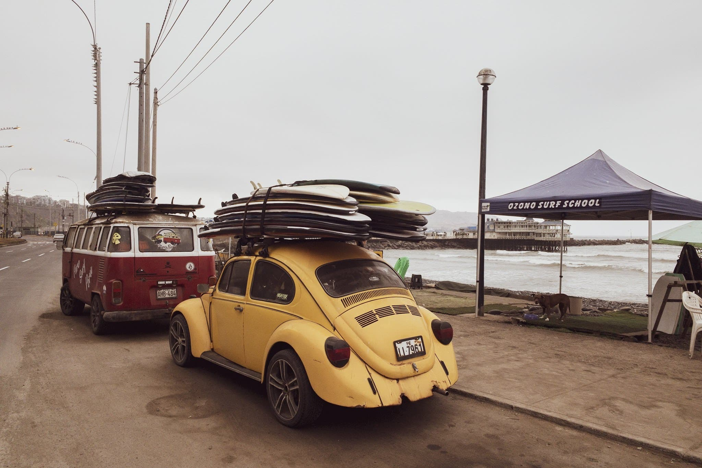
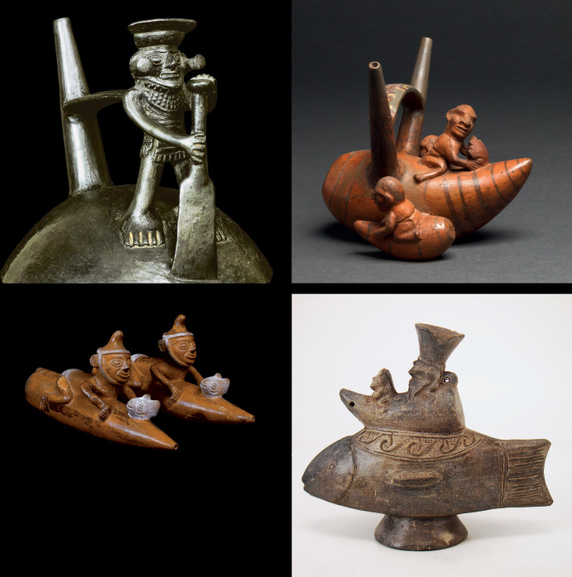

Como parte del proyecto #tuesdaysdetabla y la aplicación del concepto “deliberate practice”, recibimos el libro enciclopédico [The History of Surfing](https://www.google.com/books/edition/_/wNR_ZMZCt4kC?hl=en), de Matt Warshaw, más o menos 500 páginas dedicadas a una de las actividades más cautivantes de la historia, que no solamente pasó de ser un hobby a un deporte sino que además (y sobre todo) desarrolló una cultura propia que se extiende mucho más allá de las olas.

Pues resulta que ni bien uno abre el libro y supera la parte del prólogo, llegamos al primer capítulo: origen del surf. Teoría peruana vs. teoría hawaiana. Repitamos porque, estimado lector, no estabas preparado. Teoría PERUANA vs. teoría hawaiana.

En realidad esto no debería caer como una sorpresa a ningún perucho que haya crecido o que resida en la costa. Hay olas y tablistas por todas partes. Tenemos dos campeones mundiales en un deporte que siempre ha estado dominado por Australianos, Hawaiianos, y gringos. Y ahora que estoy aprendiendo a surfear, quizá lleguemos a tres. En diciembre, en la Costa Verde, el gran Alberto López de #SurfPeru y [www.teamsurfperu.com](http://www.teamsurfperu.com/) declaró:

> “el Perú tiene una cultura surf **sólida**”

No dijo emergente, excitante, extraordinaria, ni nada que suene a exageración o excesivo afán. La palabra fue “sólida”, algo que se adquiere y se desarrolla con el paso del tiempo y el linaje multigeneracional.

Después de una pausa, Alberto continuó: “El Perú tiene una cultura surf sólida y es el único país en donde las tablas hawaianas valen más que el mismo auto o hasta la casa propia.”

"... único país en donde las tablas valen más que el mismo auto..."

**Origen**

Volviendo al tema “origen del surf”, toda la evidencia apunta a que la actividad de utilizar un artefacto para correr olas (o sea “surfing” y no “bodysurfing”) se origina hace más de 5000 años en la costa norte del país. Huanchaco, Chicama anyone? Hace 5000 años los pescadores de la zona construían pequeñas canoas hechas de totora que, ayudados por un pequeño remo, usaban para correr olas. No solamente espumones sino olas sin reventar, como buenos surfers. Hace 5000 años las islas de Hawaii estaban todavía a 3000 años de albergar humanos llegados de la Polinesia.

Hemos tomada prestadas estas fotos de cerámicas de la Cultura Mochica (costa norte del Perú, 100-700 d.C.). Podemos apreciar claramente a los pioneros del surfing.

Esta teoría fue presentada al mundo en la revista Surfer, en el año 1988 por [Felipe Pomar](https://es.wikipedia.org/wiki/Felipe_Pomar) pero desafortunadamente el mundo del surfing simplemente se encogió de hombros. No es insensato asumir que en 1988 la cultura aún no estaba preparada para aceptar lo irrefutable. Y aún no lo está del todo, al igual que 160 años después de la publicación de El Origen de las Especies (Darwin) hay mucha gente que no “cree” en la evolución.

**Website: Historia de la Tabla en el Perú**

Para el lector que quiera dedicar un poco más de tiempo y neuronas a este tema, les recomendamos el libro y página web [www.historiadelatablaenelperu.com](http://www.historiadelatablaenperu.com/) publicada y editada por Roberto Meza, Oscar Tramontana (qepd), y Carlos Pardo.

Si dan un paso por ahí, por favor sugieran a los editores que se deshagan del “en el peru” y dejen la página como historiadelatabla, punto.

**Peru vs. Hawaii**

La teoría hawaiana tiene más “appeal” que la peruana principalmente por tres motivos:

1. las olas son mejores y más famosas,
2. el surfing siempre fue una actividad de toda la comunidad hawaiana, de la nobleza y del pueblo, no solamente de pescadores, y
3. la cercanía política de Hawaii a los Estados Unidos.

**Las olas son mejores y mas famosas**

Este es simplemente un tema de oceanografía, o topografía, o como deba llamarse apropiadamente. Las islas hawaianas están situadas a la distancia perfecta del sistema de tormentas del pacifico sur. Ni tan cerca como para que el swell llegue con demasiado desorden, ni tan lejos como para que las olas lleguen anémicas y sin violencia. (Nota: algunos disidentes dicen que es en realidad Indonesia la que esta situada a la distancia perfecta). El sistema de corales que rodea el archipiélago es otro punto a favor.

**El surfing siempre fue una actividad de toda la comunidad**

Correr olas no solamente era una actividad cualquiera, sino que era celebrada por todos. El surfing es incluso parte importante de la mitología de las islas del pacifico sur. Uno de los mitos cuenta de una jefa tribal surfer llamada Mamala, quien surfeó y se convirtió en una salamandra gigante. Un día, Mamala fue obligada a contraer matrimonio con el rey de la isla. Su verdadero amor, el surfer Ouha, del abatimiento se convierte en un dios tiburón.

> “Ahí va mi querido amor Ouha

 Ahí va el trepidante océano

 Hay buenas olas hoy

 Pero se marchó mi amor"

Dibujo de El Mundo En La Mano, publicado en 1878

**Cercanía política a los Estados Unidos**

El hecho de que Hawaii sea un estado de la Unión tiene el efecto de facilitar el impulso o la amplificación de la cultura surfing del archipiélago hacia el continente y, desde ahí, al resto del mundo. Es un poco mas difícil para los peruchos crear productos de exportación, y sobre todo en la pre-historia del siglo veinte cuando ni siquiera la PC se había inventado.

**En resumen…**

Es entendible que la teoría hawaiana sea más sexy que la teoría peruana por varias razones (viene de los trópicos y no del frío y nublado desierto, es el deporte de los reyes y no de los pescadores, etc.), pero que una teoría sea sexy no la hace verdadera.
