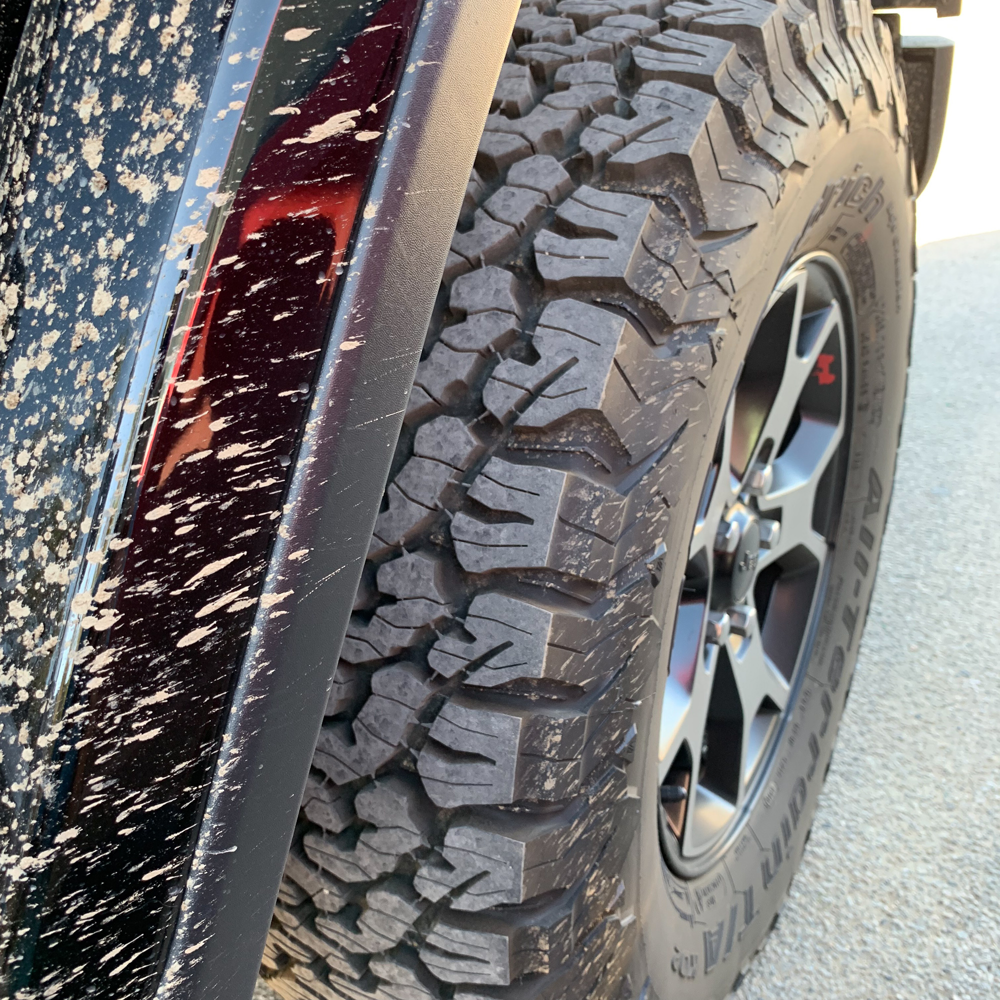

Nuestra Jeep merece un post.

La compramos en octubre del 2018. Hasta ese entonces habían sido 15 años de una secuencia de autos sedan.

Era hora de hacer cambios. Buscar algo con un perfil un poco más aventurero. Quizá una SUV, pero las “city” o “luxury” SUVs siempre nos parecieron una pequeña aberración: volumen de más, consumo de gasolina excesivo, incapacidad para ir realmente off-road, manejadas principalmente para ir de la casa al centro comercial.

Pensamos en las Subaru Crosstrek o Outback, pero preferíamos algo verdaderamente 4x4, algo genuinamente off-road. Y en la tradición de off-roads: la Jeep Wrangler o la Toyota Land Cruiser.

Elegimos la Wrangler sobre la Land Cruiser por dos factores: 1) las Land Cruiser son demasiado caras, y 2) el look de la Wrangler es inconfundible, además de su historia que se remonta a la Willis MB de la Segunda Guerra Mundial.

Comentario marginal: las Land Cruiser cuestan más porque son realmente indestructibles. El 2019 viajamos a Tanzania y observamos que el 100% de las camionetas en el Serengeti eran Land Cruisers. Cuando preguntamos al respecto, los guías de safari nos dijeron que décadas atrás se usaban Land Rovers, pero que fueron reemplazadas por Toyotas porque “nunca mueren”.

## Por qué merece un post?

Por qué? Porque cambió nuestra relación con los autos y nuestro *estilo de vida*. Nos desahuevó. Cuando, en una visita a Lima, mediodiablo mencionó que habíamos comprado una Jeep Rubicon, el gran Pedrín (leyenda del surf) exclamó:

> felicitaciones! ahora sí por fin puedo llamarte “sobrino”!

## Desahuevamiento

El temor a abolladuras y rayones fue aniquilado a las dos semanas de tener la Jeep. Pasamos un fin de semana en el desierto de Mojave tomando clases de off-roading. El *workshop* incluía ejercicios para dominar colinas con bastante pendiente, de subida y de bajada, manejo sobre rocas (_rock crawling_), rescates de autos atascados, pasajes sobre pozas y arroyos, y otras huevadas más.

La Jeep perdió varios años de vida y 25% de su valor de mercado ese fin de semana, pero lo valió. Eliminó la innecesaria ansiedad de hacerle un rayoncito más a la Rubicon. Nos quitó un gran peso de encima. Algo que imaginamos imposible si se maneja un sedan o una luxury SUV.

## Llantas todo terreno (all terrain) y 4x4

Ah... manejar sin temor a rayones y sin miedo a chancar los aros... saber que podemos trepar a la acera o que no vamos a atollarnos si se nos acaba la pista y queda frente a nosotros barro, arena, nieve... no tiene precio.

## Perspectiva y visibilidad

Sentarse al volante nos da una perspectiva diferente. Por encima de casi todos los demás conductores. No solamente mejora la visibilidad sino que -nos de vergüenza decirlo- influye psicológicamente, algo así como un pequeño empuje a la confianza en uno mismo. Quizá nos equivoquemos y esto último sea producto de otra cosa (p.ej. producto de “madurar”... pero lo dudamos, nosotros somos cojudos simples, de corto alcance).

### Pero lo realmente importante es el impulso a salir de casa...

## Expediciones

Con la llegada de la Jeep, la cantidad de expediciones se ha incrementado mas de diez veces.

Cualquier fin de semana o día libre es la excusa para salir a explorar. Yosemite, Grand Canyon, Joshua Tree, Death Valley, Morro Bay, Leo Carrillo, innumerables visitas a playas y montañas, camping, etcétera.

## Reencuentro con el Pacífico

También nos hemos reencontrado con el océano. Crecimos acampando al sur de Lima en el kilómetro 110 cuando no había ni un alma por esos lares. Desde 1976 hasta 1988 pasábamos todos los viernes, sábados, y domingos de los veranos en sarapampa. Pescando, explorando, surfeando.

Hoy con la Jeep, echamos los paddle boards en el techo y las shortboards en la maletera y en 20 minutos ya estamos en el agua.

El pequeño sinsabor de este cambio en actividades es la pregunta que nos visita cada cierto tiempo: dónde estuvimos los últimos diez años cuando éramos jóvenes?

