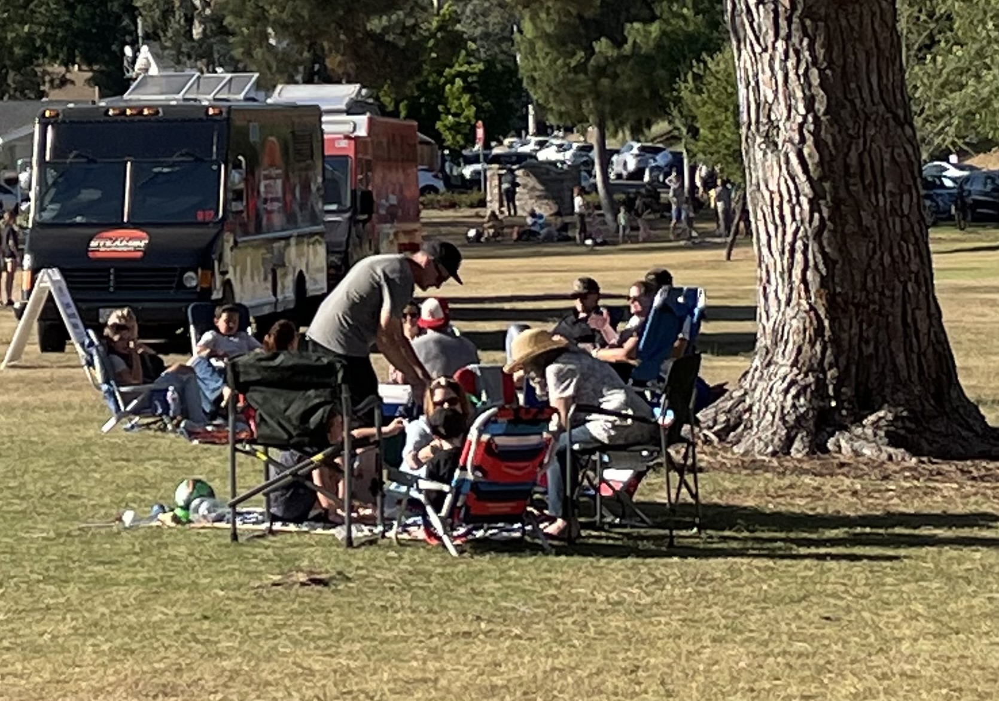
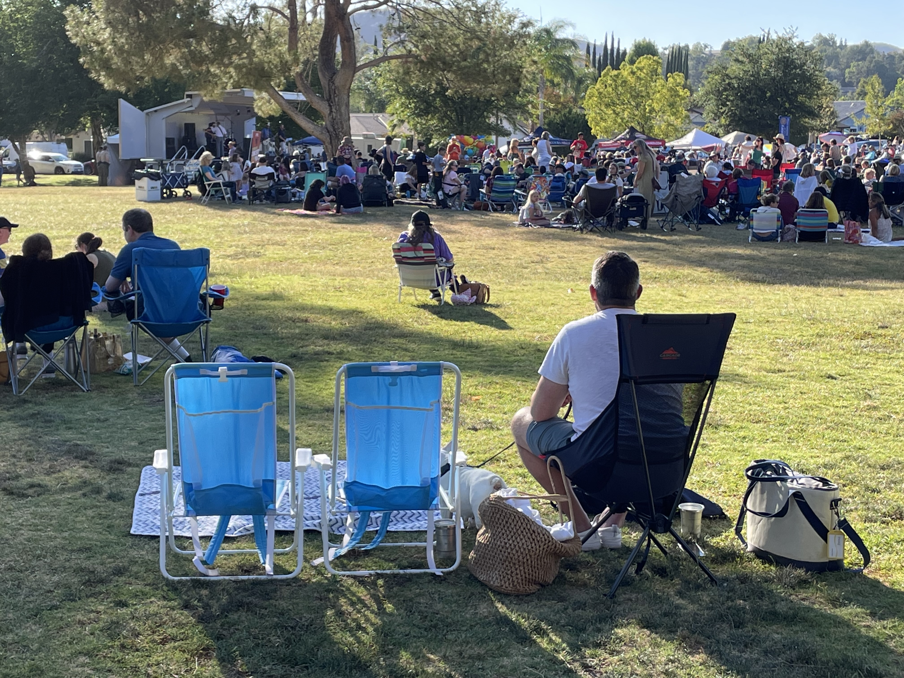
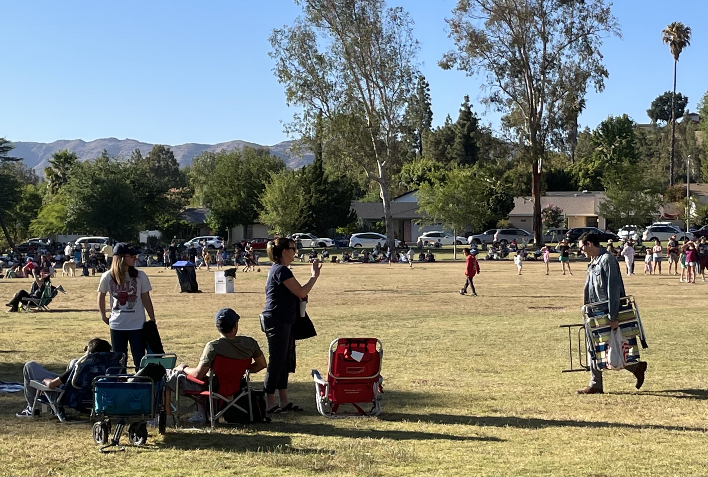
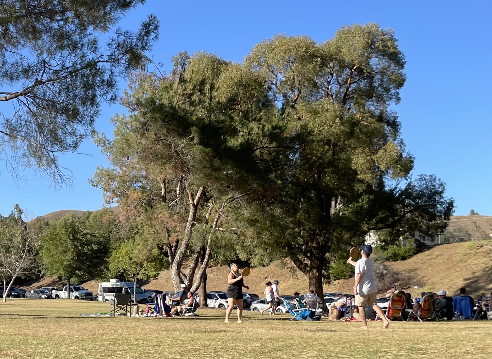
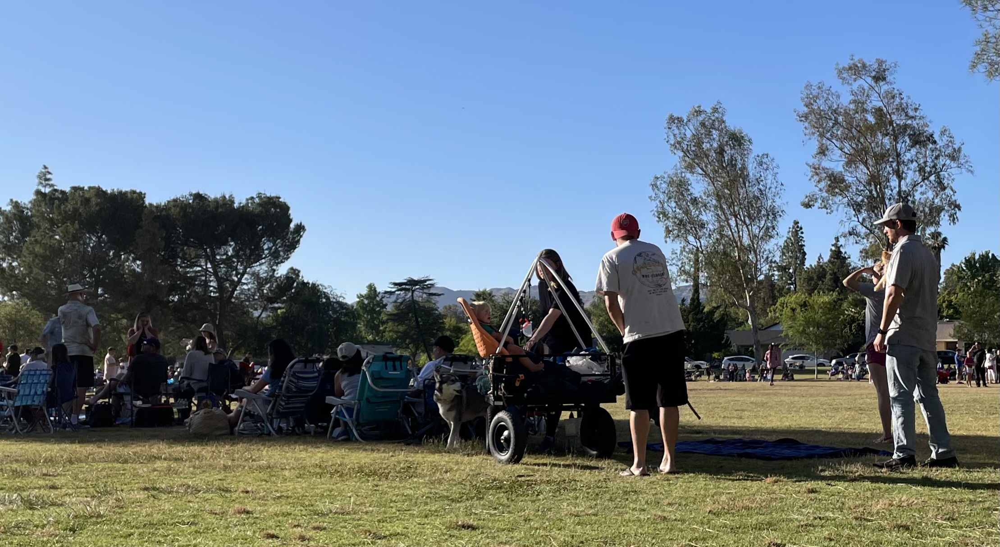

ayer fue mi primer Día del Padre. Aprendí un par de cosas.

## #1: el padre no es el agasajado

Lo primero que aprendí fue que la persona celebrada no era yo. Muy diferente al día de la madre, en el cual sí se celebra y se hace lo que las madres quieren hacer.

Desde hace semanas me andaban preguntando qué quería hacer por mi día. Pensé que era una pregunta veraz y no retórica y respondí honestamente que NO quería hacer nada.

Pero las preguntas seguían (siempre con un tono amable pero a la vez con un dejo de despotismo).

Entonces cambié mi respuesta y dije que me gustaría un [gorrito](https://www.quiksilver.com/freecycle-snapback-hat-AQYHA04991.html?ref=cojudeces.com). Algo útil, de poco costo, pero suficiente como para satisfacer la necesidad de que me ofrenden algo. Al fin y al cabo sería mi primer día del padre.

### "Pero experiencias valen más que cosas materiales"

Eso fue lo que me respondieron. Dije muy bien y, cuando todos dormían, hice una breve lista de las experiencias que quería para mi día especial:

1. NADA.

En otras palabras:

a. No ir a ningún lado donde haya aglomeración de humanos  
b. No ir a ningún lugar bullicioso  
c. Que no me hablen  
d. Que no me pregunten tonterías  
e. Que no me estresen con micro decisiones (p.ej. compro una docena o media docena de huevos? dejo la ropa sucia del bebe en la canasta de ropa sucia o en la lavadora?)

A la mañana siguiente, no preguntaron qué experiencia me gustaría, sino preguntaron si un paseo en bote sería una experiencia agradable para mí. La respuesta era no, así que respondí “sí”.

Pero ahí no acabó todo.

No había botes disponibles para el día del padre y tuvimos que separar fecha en julio. Esto dejaría el domingo día del padre completamente libre, así que lo llenaron de otras *experiencias*.

- Desayuno picnic en las montañas: empacar, manejar, desempacar, armar la mesa de picnic, espantar abejas, etc.
- Almuerzo al lado del mar (en [Duke’s Malibu](https://www.dukesmalibu.com/?ref=cojudeces.com)): empacar, manejar, desempacar, esperar 45 minutos a que se desocupe una mesa, etc.
- Cena picnic en un parque donde había un concierto gratuito: empacar, manejar, buscar estacionamiento, estacionar a 5 cuadras del parque, desempacar, caminar, buscar un lugar donde hacer el picnic, etc.

## #2: no estoy solo en este mundo

Lo segundo que aprendí es que no estoy solo en este mundo. El parque estaba repleto de gente y la banda musical tenía los parlantes a todo volumen (ver puntos “a” y “b” arriba).

Encontramos un lugar en la sombra donde sentarnos.

La gente seguía llegando y se podía ver claramente en cada familia algo inescapable:

Padres de familia que avanzaban como zombies, que tampoco querían empacar, manejar, desempacar, estacionar, caminar, jalar un vagón, empujar un coche… ellos sólo querían paz.

Aquí algunas fotos.

