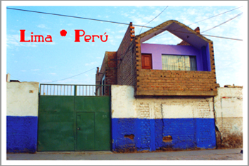
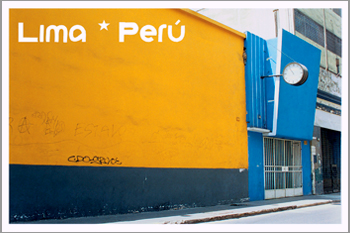
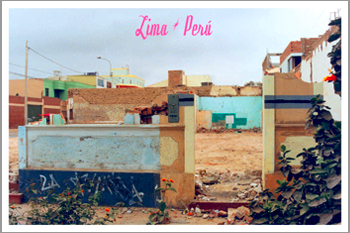

En septiembre del año pasado nuestro conspicuo y reservado colaborador Pedri nos obsequió un manojo de postales “para que tus patas conozcan”, dijo. La foto muestra una de ellas: Casa Lila. Las saboreamos una por una, despacito. Exquisitas.

> Para que tus patas conozcan

Pero teníamos que preguntar:

- "¡Qué es esto!"
- "Lima \* Perú" - fue lo único que contestó.

Las habíamos olvidado por algún tiempo, pero con la mudanza salieron a flote, así que las volvimos a experimentar y nuevamente nos parecieron ge-nia-les. Sí: geniales, y esta vez lo proclamamos sin ironía ni sazón alguna, pues no hay lugar para éstas: las postales lo contienen todo. Click [aquí](http://www.bazarbambi.org/menu/Proyectos/LimaPeru/LimaPeru_II.htm) para verlas.

Hicimos un poco de investigación en internet y encontramos lo siguiente:

> “Lima\*Perú es parte de un proyecto en curso, que en sus diversas versiones utiliza el formato convencional y virtual de la postal como medio para el análisis de la imagen de la ciudad; su construcción y su circulación. A la vez que propone la creación y proliferación de nuevas versiones a partir de una visión propia y personal de nuestro entorno...

> ... Las imágenes que forman parte de Lima \* Perú revelan una mirada sobre Lima, distante pero interesada, insolente pero dignificante, tratando de capturar los espacios ausentes, los intersticios en el ejercicio de representación de esta ciudad, y mostrar su carga simbólica y afectiva.”

Descripción breve y un poco posera típica de "artistas" y críticos... En este caso, creemos que bastaba con decir **Lima \* Perú**.

Cómo no vive Julio Ramón Ribeyro para que vea estas delicateces.
