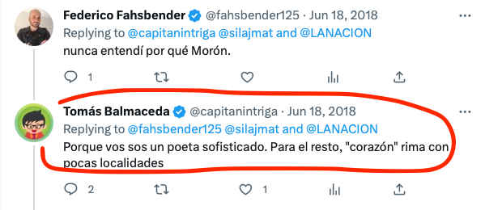

"tengo entendido que hubo un tiroteo en Morón..." fue lo que explicó nuestro gran amigo creativo y mitómano superhéroe del barrio cuando con Martín nos rascábamos las cabezas tratando de interpretar la letra de la canción.

"... en Argentina", aclaró como siempre con el dato iluminador.

TLDR: no significa ni mierda.

Pero no nos bajoneemos. Recordemos que somos co-autores y cómplices de la música que escuchamos.

## preámbulo (i.e., floro innecesario que sólo Martín entiende)

Fue el 95 o 96 cuando la escuchamos por primera vez. En esos años transitábamos una red invisible de caminos en busca de la mejor música que, con seguridad, había sido escrita en el pasado.

Por ejemplo: el observador distraído o desentendido veía a puertas de la Universidad de Lima nada más que un popurrí de vendedores de cassettes de música y de videos y otras cojudeces. Lo que no distinguía era que uno de ellos, Gary (apodado burdamente Dolmo porque se parecía a un efímero jugador de la U) era distinto.

Traía consigo historias y conocimiento y música para descubrir. Por ejemplo, Tema de Pipi de Alejandro Correa, Botas Locas de Sui Generis.
Y así como Gary era un nodo en esta red invisible, existían también algunos otros: comerciantes escondidos en mercados (Polvos Azules), amigos de amigos por aquí, familiares por allá. Gente que conocía partes y buscaba el todo de ese cancionero de temas que, como dice Emilio del Guercio, "llegan a nuestros corazones, y por algún motivo indescifrable... se quedan para siempre."

No recordamos con precisión quién nos pasó el cassette de Tango Feroz, pero sí recordamos el efecto que El Amor Es Más Fuerte causó. La tocábamos en guitarra y la cantábamos a todo pulmón, a cualquier hora del día y de la noche y en cualquier lugar.

Pero y ese segundo verso... qué significado tenía?

## la cruda verdad

Hemos investigado el tema y triste la conclusión es que cagarte a tiros en Morón no se refiere a ningún incidente en particular, ni tampoco tiene un significado metafísico para los autores Fernando Barrientos y Daniel Martín.

Lo que es peor aún es que El Amor Es Más Fuerte fue compuesta deliberadamente para ser parte del soundtrack de la película Tango Feroz. Nada más. En palabras de Barrientos: "nunca nos olvidamos de que trabajábamos para un film."

Nuestra hipótesis es que, cuando escribían la canción, el primer verso les salió muy bueno:

"Pueden robarte el corazón..."

Y empezaron la segunda línea con fuerza:

"Cagarte a tiros en..."

Aquí Barrientos y Martín necesitaban algo que rimara con "corazón", algún barrio o distrito de Buenos Aires, y así salió Morón.

Por ejemplo aquí una visión concordante:

## qué cagada, no?

Ánimo, el amor es más fuerte. Aquí dejamos siete anécdotas acerca del tema.

1. La peli Tango Feroz iba a tener como tema principal La Balsa, pero Litto Nebbia negó que la usaran porque no le gustó el guión. Esto hizo que Marcelo Piñeyro, director de Tango Feroz, comisionara a Fernando Barrientos y Daniel Martín, del duo Caín Caín, con la creación de una canción himno que encajara con la película.
2. Una de las fuentes de inspiración fue el tema Pato Trabaja En Una Carnicería, del gran Moris.
3. Los autores declararon "La compusimos respetando puntualmente el guión. Teníamos que hacer un hit... Todo lo que escribimos lo hacía ese Tanguito del guión: nunca nos olvidamos de que trabajábamos para un film."
4. Quién la canta en Tango Feroz? No Barrientos ni Martín, sino Ulises Butrón porque tenía una voz que se asemejaba más a la voz del actor que hacía de Tanguito.
5. Curiosamente, Fernando Barrientos interpreta otra canción, de manera impecable: Presente, de Ricardo Soulé.
6. La peli Tango Feroz causó polémica porque según contemporáneos de Tanguito, presenta una imagen irreal y distorsionada del artista. Por eso Litto Nebbia dijo no a permitir que usen La Balsa.
7. La respuesta de Barrientos es contundente: "La película nunca tuvo la intención de comportarse como un documental. La figura de Tango es como una metáfora de una época, de una forma de escribir canciones y de vivir."
